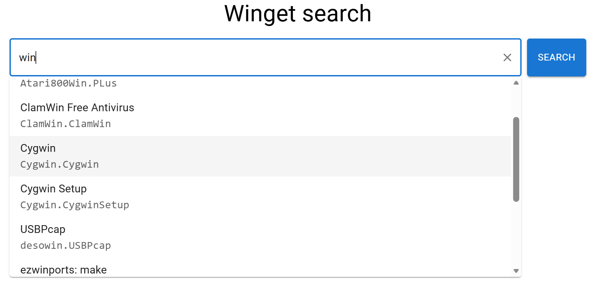
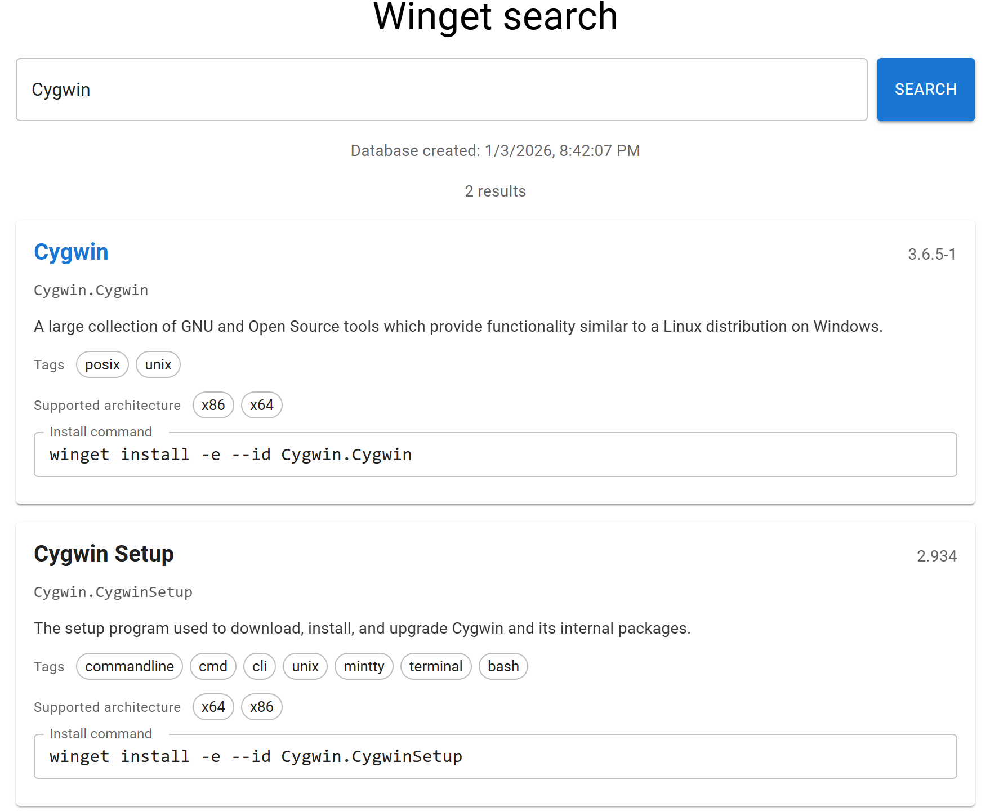

# WingetSearchWebSite

[WingetSearchWebSite](https://polargoose.github.io/WingetSearchWebSite/)

A web site to search [winget](https://github.com/microsoft/winget-pkgs) packages. 
It is an alternative to:
* https://winget.run/
* https://winstall.app/

# Screenshots
## Autocomplete

## Search results

# Features
* Static website: no back end, everything is executed on the client side
* Fully hosted on GitHub Pages
* Up to date: the database is updated every 4 hours
* Autocomplete in the search box
* Straightforward interface, no bloat

# Limitations
Loading time is a bit slow because the website needs to download the entire database (about 5MB) and load it into memory

# Implementation details
During website build, the `create-winget-packages-flexsearch-db` project is run. It clones the [winget-pkgs](https://github.com/microsoft/winget-pkgs) repository and parses the YAML files for the latest versions of each package.
Then it creates a [flexsearch](https://github.com/nextapps-de/flexsearch) database to enable searching by `PackageId` and `PackageName`.
This index is exported as a JSON file that is used by the website.

The website is written using React and Typescript. When the website opens, it loads the flexsearch database JSON file.
